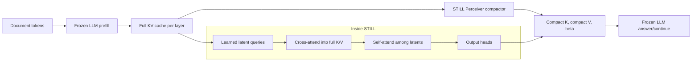
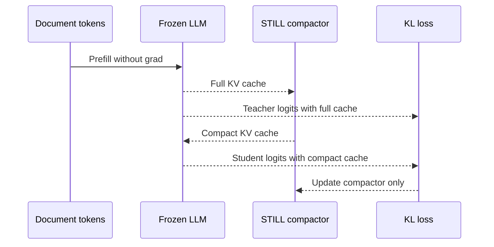
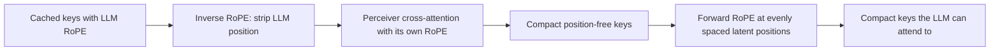
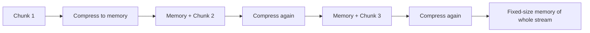

# STILL: nén KV cache bằng Perceiver để tiến gần tới context window "vô hạn"

> Giải thích bài research [Towards infinite context windows: neural KV cache compaction](https://www.baseten.co/research/towards-infinite-context-windows-neural-kv-cache-compaction/) của Baseten, tập trung vào phần Results.  
> Bài gốc đăng ngày 2026-04-01. Nhóm tác giả sau đó có bản paper arXiv [Still: Amortized KV Cache Compaction in a Single Forward Pass](https://arxiv.org/abs/2606.07878), submitted ngày 2026-06-05. Tài liệu này dùng bài Baseten làm nguồn chính; bản arXiv chỉ được nhắc như bối cảnh cập nhật.

## 1. Tóm tắt trong một câu

STILL học một bộ nén nhỏ cho KV cache của LLM: thay vì giữ toàn bộ cache của 8192 token, nó biến cache đó thành một số latent ngắn hơn, ví dụ 1024 latent cho nén 8x, rồi để LLM frozen dùng cache nén như thể đó là cache thật.

Kết quả đáng chú ý trong bài Baseten:

- Ở 1024 latents trên context 8192 token, STILL đạt khoảng 85% MCQ accuracy, KL khoảng 0.15, CE utilization khoảng 0.93.
- Ở 128 latents, tức nén 64x, accuracy vẫn khoảng 60%, cao hơn rõ so với no-context baseline 20-22%.
- Với nén 8x, domain Code đạt 89.6% MCQ accuracy, Financial 86.0%, Gutenberg 79.2%, Legal 75.6%.
- Cross-domain transfer không sụp: mọi cặp train/eval đều giữ MCQ accuracy từ 70% trở lên trong Figure 8.
- Phần "infinite context" trong bài Baseten vẫn là hướng đi, chưa phải kết quả đã chứng minh. Iterative compaction đang được đánh giá.

## 2. Vấn đề thật sự: không chỉ là context window dài hơn

Khi LLM sinh token, mỗi layer lưu lại key và value của các token trước đó trong KV cache. Cache này giúp model không phải forward lại toàn bộ prefix mỗi bước. Đổi lại, chi phí bộ nhớ tăng gần tuyến tính theo số token, số layer, số head và head dimension.

Nếu bạn tăng context từ 8K lên 128K, bạn không chỉ tăng "văn bản có thể đọc". Bạn tăng cả trạng thái mà model phải giữ và attend qua trong decoding. Với agent chạy nhiều giờ hoặc nhiều ngày, cache đầy lên liên tục. Đến khi cửa sổ hết chỗ, bạn phải chọn:

- giữ nguyên KV cache: fidelity tốt, chi phí cao;
- tóm tắt: rẻ hơn, nhưng mất nhiều chi tiết và mất cấu trúc attention nội bộ;
- RAG: lưu text bên ngoài model, phụ thuộc retrieval;
- fine-tuning/LoRA: biến trải nghiệm thành weight, nhưng chậm và không hợp với từng phiên làm việc.

Baseten đặt STILL ở lớp giữa: một working memory nén, vẫn nằm trong representation mà LLM có thể attend trực tiếp.

## 3. STILL làm gì?

Ở mỗi layer của LLM frozen, STILL nhận full KV cache:

```text
K_l, V_l  shape khoảng: [T, H, d]
```

và sinh cache nén:

```text
Ck_l, Cv_l, beta_l  shape khoảng: [t, H, d], với t << T
```

Nếu `T = 8192` và `t = 1024`, compression ratio là 8x. LLM không được fine-tune. Phần học được là compactor.



Cách nghĩ trực quan: mỗi latent là một "ô nhớ" học cách hỏi full cache về một lát thông tin. Cross-attention giúp các ô nhớ nhìn vào toàn bộ cache. Self-attention giúp chúng tránh trùng nhau và phối hợp. Output heads biến latent thành key/value/bias mà attention của LLM dùng được.

Điểm hay nằm ở chữ amortized: STILL không tối ưu cache riêng cho từng context lúc inference. Nó học một function nén chung trong training, sau đó nén bằng một forward pass.

## 4. Training: distill cache, không distill model

Bài Baseten huấn luyện bằng teacher-student:



Loss chính là KL divergence giữa phân phối token của:

- teacher: LLM frozen dùng full KV cache;
- student: chính LLM đó dùng compact KV cache.

Dữ liệu huấn luyện gồm MCQ extractive sinh từ tài liệu dài. Mỗi câu hỏi ép compactor giữ một fact cụ thể: liều thuốc, ngày tháng, tên biến, điều khoản pháp lý, chi tiết trong văn bản. Đây là bài test khó cho nén lossy vì chỉ cần bỏ sót một chi tiết nhỏ là trả lời sai.

Một chi tiết quan trọng: nhóm tác giả nhận thấy answer text nên đến từ chính model được compact. Nếu dùng answer sinh bởi model khác, compactor có thể học lệch phân phối sang phong cách của model kia thay vì giữ thông tin trong cache.

## 5. Ba sửa đổi khiến hệ thống train được

### 5.1. RoPE-aware position encoding

KV cache của transformer dùng RoPE đã chứa positional encoding trong key. Nếu Perceiver lấy trung bình key ở vị trí 5, 42 và 300, kết quả không còn là key hợp lệ tại một vị trí rõ ràng. Nó trộn nhiều pha vị trí vào một vector.

STILL xử lý bằng ba bước:



Nói ngắn gọn: trước khi nén thì gỡ RoPE của LLM, trong lúc nén thì cho Perceiver biết vị trí bằng RoPE riêng, sau khi nén thì gắn lại RoPE sạch ở vị trí latent.

### 5.2. Bỏ final normalization

Perceiver chuẩn hay dùng RMSNorm cuối trước output heads. Trong bài này, nhóm tác giả bỏ nó. Lý do: norm của vector key/value thật không chỉ là nhiễu; nó mang tín hiệu mà attention của LLM quen dùng. Nếu ép mọi latent về cùng RMS, compactor phải học bù lại thông tin vừa bị xóa.

### 5.3. Identity initialization với attention biases

Ban đầu, compactor không scale tốt khi tăng latent count. 128 latent còn ổn, 256 không cải thiện, 512 trở lên có thể diverge. Sửa đổi quyết định là khởi tạo Perceiver gần như một hàm identity:

- value pathway khởi tạo như đường truyền thẳng, để latent copy key/value lân cận;
- Q/K pathway dùng bias để routing ban đầu phụ thuộc chủ yếu vào vị trí RoPE, không phụ thuộc nội dung;
- một số residual branch được zero-init để tránh nhiều latent học cùng một thứ lúc đầu.

Từ baseline "copy theo vị trí", training mới dần học nén theo nội dung. Đây là khác biệt lớn so với việc để hàng trăm latent bắt đầu từ random rồi hy vọng gradient tự chia việc.

## 6. Metrics: đọc kết quả như thế nào?

Bài dùng hai nhóm metric chính:

**MCQ accuracy** đo factual retention. Câu hỏi MCQ nhắm vào fact cụ thể trong document. Nếu cache nén giữ được fact đó, model có cơ hội trả lời đúng.

**Utilization** đo phần khoảng cách giữa no-context và full-cache mà compact cache đã thu hồi:

```text
utilization = (no_context_metric - compact_metric) / (no_context_metric - full_cache_metric)
```

Với metric lower-is-better như cross-entropy, công thức đọc thẳng. Với accuracy, công thức tương đương với `(compact - no_context) / (full_cache - no_context)`. Utilization 1.0 nghĩa là compact cache ngang full cache. Utilization 0.0 nghĩa là compact cache không hơn no-context.

## 7. Results: scaling theo số latent

Các thí nghiệm trong phần Results dùng Qwen3-4B, context 8192 token, training trên 8x H200, compactor 2 block, 1 cross-attention head, 1 self-attention head, latent dimension 256, khoảng 7.1M trainable parameters, tức khoảng 0.18% base model.


Ghi chú: đường trong chart trên là xấp xỉ đọc từ Figure 4 của Baseten; các mốc 128L, 1024L và 8192L được neo theo mô tả văn bản trong bài.

Điểm cần nhìn:

- 128 latent = 64x compression: MCQ accuracy khoảng 60%, trong khi no-context baseline chỉ khoảng 20-22%.
- 1024 latent = 8x compression: MCQ accuracy khoảng 85%, CE utilization khoảng 0.93, compact KL khoảng 0.15.
- 8192 latent = 1:1: tiến gần full cache, như một sanity check cho khả năng scale của kiến trúc.
- Đường không có "vách đá". Bạn có knob liên tục giữa memory budget và fidelity.

Knob này quan trọng cho production. Bạn không cần chọn giữa full cache và summary mù mờ. Bạn có thể nói: với workload này, 8x đáng tiền; với workload kia, 16x đủ; với archive dài, 64x vẫn tốt hơn bỏ context.


## 8. Results: nén 8x theo domain

Ở 1024 latents trên context 8192 token, bài huấn luyện checkpoint theo từng domain và báo cáo bảng sau.


| Domain | MCQ accuracy | MCQ utilization |
|---|---:|---:|
| Financial | 86.0% | 79.4% |
| Legal | 75.6% | 71.7% |
| Code | 89.6% | 87.0% |
| Gutenberg | 79.2% | 75.9% |

Code và Financial dễ nén hơn trong kết quả này. Cả hai thường có cấu trúc địa phương mạnh: tên biến gần logic dùng nó, số liệu tài chính gần bảng hoặc câu giải thích, field và value đứng gần nhau. Legal và Gutenberg khó hơn vì ý nghĩa thường phụ thuộc đoạn dài, tham chiếu xa, giọng văn và ngữ cảnh rộng.

Điểm đáng chú ý: Legal vẫn đạt 75.6%, tức thấp nhất trong bốn domain nhưng không vỡ. Đây là tín hiệu rằng compactor không chỉ học vài mẹo định dạng của code hoặc tài chính.

## 9. Results: giữ 8x khi context dài hơn

Một control quan trọng: giữ compression ratio là 8x, nhưng thay context length:

- 1K context -> 128 latents;
- 2K context -> 256 latents;
- 4K context -> 512 latents;
- 8K context -> 1024 latents.


Ghi chú: chart này xấp xỉ từ Figure 7. Bài nêu MCQ accuracy ổn định trong khoảng 85-92%.

Kết quả này trả lời một câu hỏi thực tế: compactor có học "1024 latent là tốt" hay học "nén theo tỷ lệ 8x"? Figure 7 nghiêng về vế thứ hai. Khi tăng context và tăng latent tương ứng, accuracy không sụp.

Đây là điều kiện cần cho variable-length generalization. Nếu mô hình chỉ hoạt động ở một số latent cố định, nó khó trở thành memory layer dùng được trong hệ thống agent.

## 10. Results: cross-domain transfer

Figure 8 kiểm tra train trên một domain, eval trên domain khác. Đây là phần hay nhất nếu bạn quan tâm tới "universal compactor".


### MCQ compact accuracy

| Eval / Train | Financial | Legal | Code | Gutenberg |
|---|---:|---:|---:|---:|
| Financial | 87% | 86% | 77% | 78% |
| Legal | 74% | 81% | 87% | 82% |
| Code | 70% | 74% | 77% | 72% |
| Gutenberg | 72% | 76% | 76% | 89% |

### CE utilization

| Eval / Train | Financial | Legal | Code | Gutenberg |
|---|---:|---:|---:|---:|
| Financial | 68.4% | 78.1% | 76.7% | 64.8% |
| Legal | 59.4% | 77.6% | 73.0% | 57.0% |
| Code | 52.7% | 69.6% | 74.0% | 53.1% |
| Gutenberg | 65.5% | 78.1% | 78.9% | 74.3% |

Cách đọc:

- Đường chéo là train và eval cùng domain.
- Ngoài đường chéo là transfer thật.
- Code-trained checkpoint transfer tốt nhất về MCQ: 78-89% theo mô tả của bài.
- Financial-trained checkpoint transfer yếu hơn, nhưng vẫn không có ô MCQ nào dưới 70%.
- CE utilization nhạy hơn MCQ. Điều này hợp lý vì CE kiểm tra toàn bộ phân phối token, không chỉ chọn đáp án đúng trong một câu MCQ.

MCQ có thể nói "fact còn đó". CE hỏi thêm "phân phối suy luận/sinh tiếp có giống full cache không?". Một hệ thống production cần nhìn cả hai, nhất là nếu task đòi hỏi viết tiếp hoặc reasoning dài.

## 11. Vì sao kết quả này khác với token eviction?

Nhiều phương pháp KV compression chỉ bỏ bớt token: giữ token có attention score cao, bỏ token ít quan trọng. Cách đó rẻ nhưng bị giới hạn: compact cache vẫn là subset của cache cũ.

STILL tổng hợp representation mới. Một latent có thể trộn thông tin từ nhiều vị trí, miễn sao vector cuối cùng nằm trong vùng mà LLM hiểu được. Đây là lý do Perceiver bottleneck hợp với bài toán này: nó không chỉ chọn token; nó học cách đóng gói cache.

So với các phương pháp optimize per-context như Attention Matching hoặc Cartridges được bài Baseten nhắc tới, STILL đổi một phần chất lượng tiềm năng để lấy tốc độ inference. Nó nén bằng forward pass, không cần tối ưu riêng từng context trong vài phút hoặc vài giờ.

## 12. Iterative compaction: nơi chữ "infinite" bắt đầu có nghĩa

Một pass STILL chỉ nén context cố định, ví dụ 8K token thành 1024 latent. Để vượt cửa sổ hữu hạn, tác giả đề xuất lặp:



Vấn đề kỹ thuật: lần nén thứ hai không chỉ thấy KV thật từ LLM. Nó thấy cả compact KV do chính STILL sinh ra. Distribution của compact KV có thể khác KV thật. Nếu compactor chưa được train để xử lý output của mình, lỗi sẽ tích lũy qua nhiều pass.

Bài Baseten nói họ đang đánh giá hướng này và gợi ý training bằng số pass ngẫu nhiên như `{1, 2, 4, 8}`. Vì vậy, "infinite context" trong bài là roadmap có cơ sở, không phải kết luận đã đóng.

## 13. Ý nghĩa cho hệ thống agent và serving

Nếu STILL hoặc một biến thể của nó scale tốt, nó tạo ra một tầng memory mới:

```text
Recent context: giữ full KV, fidelity cao
Older context: nén bằng STILL, fidelity vừa đủ
External memory: RAG / database / notes
Long-term learning: weights / adapters
```

Tầng này đặc biệt hợp với:

- agent code cần nhớ nhiều file và nhiều vòng sửa;
- phân tích pháp lý hoặc tài chính với tài liệu dài;
- medical/clinical workflow cần giữ chi tiết mà summary dễ làm mất;
- multi-session assistant cần carry context qua nhiều đoạn hội thoại;
- batch inference với long documents, nơi KV memory quyết định throughput.

Thiết kế production hợp lý sẽ không nén mọi thứ. Nó nên giữ đoạn mới nhất ở full fidelity, nén phần cũ theo tỷ lệ tùy task, và dùng retrieval cho nguồn dữ liệu ngoài phiên làm việc.

## 14. Đọc phản biện

**1. "Infinite" vẫn là mục tiêu.**  
Bài Baseten chứng minh single-pass compaction mạnh trên 8K context. Nó chưa chứng minh iterative compaction qua hàng trăm chunk mà không drift.

**2. MCQ extractive tốt nhưng chưa đủ.**  
MCQ nhắm vào fact cụ thể nên có giá trị. Nhưng sản phẩm thật còn cần multi-hop reasoning, tool use, code execution context, summarization, dialogue state và lỗi hiếm. Cần benchmark rộng hơn.

**3. Accuracy không phải lossless.**  
85-90% nghe rất tốt ở 8x, nhưng 10-15% mất mát có thể không chấp nhận được trong pháp lý, y tế hoặc code migration. Dùng STILL như memory tier, không như bằng chứng rằng có thể bỏ full context ở mọi nơi.

**4. Domain transfer tốt, nhưng chưa thành universal.**  
Code checkpoint transfer rộng. Financial checkpoint yếu hơn. Muốn triển khai rộng, cần train/eval trên nhiều domain hơn và đo drift theo thời gian.

**5. Chi phí ingestion vẫn tồn tại.**  
Để nén một chunk, bạn vẫn cần prefill chunk đó qua LLM để có KV cache. STILL giảm trạng thái lưu và attend về sau; nó không biến việc đọc input dài thành miễn phí.

**6. Kiến trúc gắn với RoPE và cache format.**  
Các fix như un-rotate/re-rotate phụ thuộc chi tiết positional encoding. Port sang model khác không chỉ là đổi checkpoint.

## 15. Nếu triển khai, nên chọn operating point thế nào?

| Mục tiêu | Gợi ý ratio | Lý do |
|---|---:|---|
| Chất lượng cao, vẫn muốn giảm memory đáng kể | 8x | Bài báo cáo khoảng 85% MCQ và CE utilization khoảng 0.93 ở 1024L/8192. |
| Batch dài, chấp nhận mất một phần chi tiết | 16x-32x | Scaling curve vẫn mượt, nhưng cần benchmark task cụ thể. |
| Archive/context rất cũ | 64x | Khoảng 60% MCQ vẫn hơn no-context nhiều, phù hợp tầng nhớ xa. |
| Task rủi ro cao | Giữ full KV cho phần quan trọng | Compact cache không lossless. |

Quy tắc thực dụng: nén theo tuổi của context và rủi ro của thông tin. Đo bằng benchmark của chính sản phẩm, không lấy MCQ accuracy trong bài làm SLA.

## 16. Kết luận

STILL đáng chú ý vì nó biến KV cache compaction từ bài toán "tối ưu riêng từng context" thành một module học được và chạy bằng forward pass. Kết quả 8x trên Qwen3-4B cho thấy compact cache có thể giữ phần lớn lợi ích của full cache, không chỉ trong domain đã train mà cả khi transfer sang domain khác.

Điểm kỹ thuật thuyết phục nhất không phải chỉ là con số 85-90%. Đó là ba fix làm hệ thống scale: xử lý RoPE đúng, không xóa norm signal, và khởi tạo gần identity để latent bắt đầu từ một cache có nghĩa. Những chi tiết này cho thấy bài toán không đơn giản là "ném Perceiver vào KV cache".

Điểm cần dè chừng là claim "infinite context". Bài Baseten mới chứng minh nền tảng của memory layer: nén một context dài thành cache ngắn mà LLM frozen vẫn dùng được. Để thật sự có context không giới hạn, STILL phải vượt qua bài toán re-compaction nhiều lần, drift, benchmark dài hơn và workload thực tế.

Nếu nhìn như một hướng research cho LLM memory, đây là một bước đáng kể: nén không còn là tóm tắt text bên ngoài model, mà là học cách giữ trạng thái nội bộ của chính model ở dạng nhỏ hơn.

## Appendix A: dữ liệu biểu đồ

### A.1. Scaling theo latent count

Số liệu dưới đây là xấp xỉ đọc từ Baseten Figure 4, có neo theo các mốc tác giả nêu trong bài.

| Latents | Compression | MCQ accuracy | CE utilization | Continuation utilization |
|---:|---:|---:|---:|---:|
| 128 | 64x | ~58% | ~76% | ~18% |
| 256 | 32x | ~68% | ~81% | ~28% |
| 512 | 16x | ~79% | ~89% | ~50% |
| 1024 | 8x | ~86% | ~93% | ~70% |
| 2048 | 4x | ~96% | ~97% | ~85% |
| 4096 | 2x | ~97% | ~98% | ~91% |
| 8192 | 1x | ~97% | ~99% | ~94% |

### A.2. Domain-specific 8x

Số liệu đọc trực tiếp từ bảng domain trong bài Baseten.

| Domain | MCQ accuracy | MCQ utilization |
|---|---:|---:|
| Financial | 86.0% | 79.4% |
| Legal | 75.6% | 71.7% |
| Code | 89.6% | 87.0% |
| Gutenberg | 79.2% | 75.9% |

### A.3. Cross-domain transfer

Số liệu đọc trực tiếp từ Figure 8 trong bài Baseten.

| Eval / Train | Financial | Legal | Code | Gutenberg |
|---|---:|---:|---:|---:|
| Financial MCQ | 87% | 86% | 77% | 78% |
| Legal MCQ | 74% | 81% | 87% | 82% |
| Code MCQ | 70% | 74% | 77% | 72% |
| Gutenberg MCQ | 72% | 76% | 76% | 89% |

## Sources

- Charles O'Neill, Alex Sandomirsky, Harry Partridge, Baseten Research, [Towards infinite context windows: neural KV cache compaction](https://www.baseten.co/research/towards-infinite-context-windows-neural-kv-cache-compaction/), 2026-04-01.
- Charles O'Neill, Alex Sandomirsky, Harry Partridge, Mudith Jayasekara, Max Kirkby, [Still: Amortized KV Cache Compaction in a Single Forward Pass](https://arxiv.org/abs/2606.07878), arXiv:2606.07878, submitted 2026-06-05.
